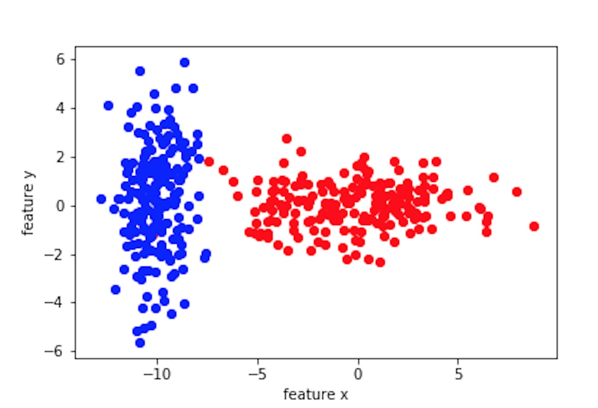
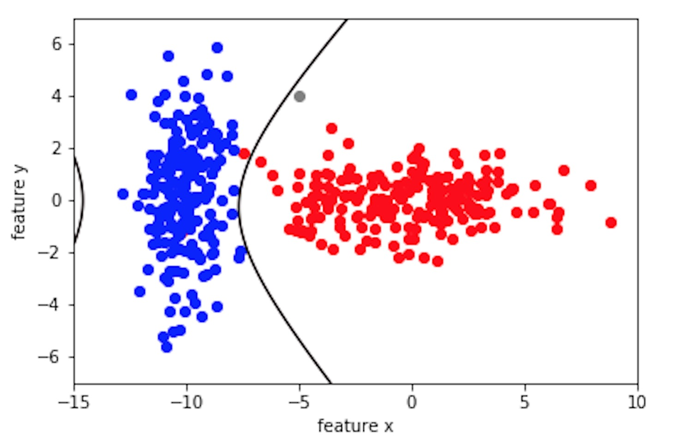
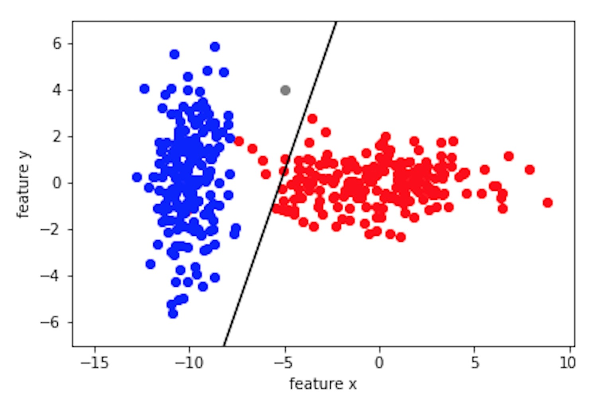

Let's talk about classifying things with probability. Probabilistic classifiers and, in particular, the Bayesian classifier, are among the most popular classifiers used in machine learning and increasingly in many applications. These classifiers are derived from a generative probability model, where Bayes rule is used to estimate the conditional probability and then assumptions are made on the model in order to decompose this probability.

Let's say we have a two dimensional feature space, with feature vectors [x,y]. We also have the training set that is labeled. The label consists of two classes, blue and red.

Here is your task: I give you a feature vector, can you tell me which class this feature vector belongs to? I also want to know the decision boundary you used to determine the class. Is this a simple task?

In other words, would you classify the grey point below as class blue or class red?

In this post, you are going to learn:

* Bayesian classifiers - what assumptions are made?
* Discriminant function - how to calculate the decision boundary?
* Linear vs quatric decision boundary - what is the difference?

## Bayesian classifiers

I asked a friend who knows nothing about classifiers to tell me which class the grey point belongs to. He said it looks like it belongs to class red due to how each class "centers" and the "spread." Then he said he basically compares the standard deviations. Little did he know, what he described is exactly the intuition behind the Bayesian classifier.

Bayesian classification is a form of probabilistic classification. Intuitively, when determining a line that separates the two classes, we look at the distribution of each class. What my friend intuitively focused on was the "center" or the mean and the "spread" or the standard deviation of the distribution. Another factor can be the prior of each class. For example, if there are more blue class to begin with, then we can think that blue class is more probable and the line would shift away from the blue class. Ok, now let's put these ideas into a more mathematically rigorous form.

Giving a feature vector $x$, we want to find the most __probable__ class. Given $M$ classes $[w_1, w_2, ... w_M]$, if $P(w_i|x) > P(w_j|x)$, then $x$ belongs to class $w_i$, and $w_j$ the other way around. Notice that this is a two class problem, but it can be generalized easily with multiple classes. So the question is how do we find $P(w_i|x)$ ?

### Bayes rule

$P(w_i|x) = {P(x|w_i)P(w_i) \over P(x)}$

Bayes rule tells me that if I want to estimate $P(w_i|x)$, then I need to know $P(x|w_i)$ and $P(w_i)$. $P(x|w_i)$ is the conditional pdf or the distribution of possible features when they belong to $w_i$. It can be estimated from the training data. $P(w_i)$ is the prior, which is known. For example, if we had equal number of blue and red classes in our training data, then the prior for each class would be 0.5. So this means that we will know $P(w_i|x)$ if we can estimate $P(x|w_i)$.

### Estimating the distribution

In order to estimate $P(x|w_i)$, we need to make some assumptions about the distribution of the data. This is where it gets "hand-wavy." Honestly, life would be so easy if we __knew__ the distribution where the data is sampled from. Is the distribution uniform? binomial? poisson? normal? maybe exponential? The thing is, we don't know, so we will have to look at the data and make a reasonable assumption.

If you don't know, assume $P(x|w_i)$ is __Gaussian__ or __normal__.

k-dimension Gaussian pdf:

$P(x|w_i) = {\exp(-0.5(x-\mu)^T \Sigma^{-1}(x-\mu)) \over {2\pi^{k/2} |\Sigma|^{1/2}} }$

* $\mu$ is the mean of class $w_i$
* $\Sigma$ is the covariant matrix of $w_i$ with size k x k defined by $E[(x - \mu)(x-\mu)^T]$
* both of these parameters can be found from the training data

### Discriminant function

Our original question: is the probability of $x$ being in $w_i$ less or greater than in $w_j$? At this point, we know how to get $P(w_i|x)$ since we know both $P(x|w_i)$ and $P(w_i)$, same applies for $P(w_j|x)$.

* $P(w_i|x) < or > P(w_j|x)$ ?

* ${P(x|w_i)P(w_i) \over P(x)} < or > {P(x|w_j)P(w_j) \over P(x)}$ ? (Bayes rule)

* $P(x|w_i)P(w_i) < or > P(x|w_j)P(w_j)$ ?

The question above partitions the feature space into two. One is when the probability of being in $w_i$ is greater than $w_j$ and the other is when the probability of $w_j$ is greater than $w_i$. So where is the __boundary__ that separates the two? This leads us into the discriminant function.

The line that separate the two spaces is exactly where $P(w_i|x) = P(w_j|x)$ or where $P(w_i|x) - P(w_j|x) = 0$.

Now let's say $g_i(x) = f(P(w_i|x))$, called the __discriminant function__, where $f()$ is a monotonically increasing function. Solving $g_i(x) - g_j(x) = 0$ will give us the decision surface or line in some cases.

Now let's write out the discriminant function $g_i(x) = f(P(w_i|x))$ in it's full form, where $f()$ is the natural log, which is monotonically increasing, in order to give a nice expression since the $P(w_i|x)$ comes from the Gaussian distribution, which has the exponential term:

$g_i(x) = ln(P(w_i|x)) = ln(P(x|w_i)P(w_i))$

$= -{1 \over 2}(x-\mu_i)^T\Sigma_i^{-1}(x-\mu_i) + ln(P(w_i)) +c_i$

Great! We now know $g_i(x)$ and the same can be said for $g_j(x)$, then we can find the decision boundary with $g_i(x) - g_j(x) = 0$ !

### Decision boundary

Let's get some intuition about the decision boundary. Since $g_i(x)$ is a function of $P(w_i|x)$, a Gaussian, so $g_i(x) - g_j(x) = 0$ is actually the intersection of two Gaussian distributions. The equation of the intersection between two Gaussians can be a circle, ellipse, parabola, hyperbola ... or an equation of polynomial of degree 2 equals zero. In other words, it is a __quatric__. Below is what we get when we solve the decision boundary. Notice the black decision boundary is a quatric.

What if we want the boundary to be a line? In other words, a linear classifier. Well, a line is just a degeneration of a second order polynomial. The second order term as well as the constant $c_i$ of $g_i(x) - g_j(x)$ disappears when $\Sigma_i$ = $\Sigma_j$. This means that if we assume the distribution of each class is Gaussian with the __same covariance__ matrix, then we have a __linear__ classifier! The discriminant function simplifies significantly into a linear equation:

$g_i(x) = a^Tx + b$

* $a = \Sigma^{-1}\mu_i$
* $b = ln(P(w_i)) - {1 \over 2}\mu_i^T \Sigma^{-1}\mu_i$

Below is what we get when we solve the decision boundary in the linear case using only the covariance of the red class.

## Conclusion

The Bayesian classifier is a probabilistic classifier where the decision boundary is determined by the intersection of two distributions. The quality of this classifier greatly depends on the assumptions that we make, such as the type of distribution (most commonly Gaussian), the type of covariance matrix (if they are the same for all classes), and the priors (was my training data randomly sampled). As you can see from the quatric decision boundary vs. the linear boundary, the quatric classifies the grey point as class red while the linear classifies it as class blue. So when we make these assumptions, we need to ask our selves if the tradeoff in complexity is worth it since these assumptions influences the results of the classifier. However, even with these simplified probabilistic assumptions, Bayesian classifier work remarkably well in practice. I believe the reason Bayesian classifier does well in applications is that it is simple and intuitive, as shown by my friend's intuition, where the decision boundary is simply an equation that combines the means, covariances, and the priors of the two classes!
