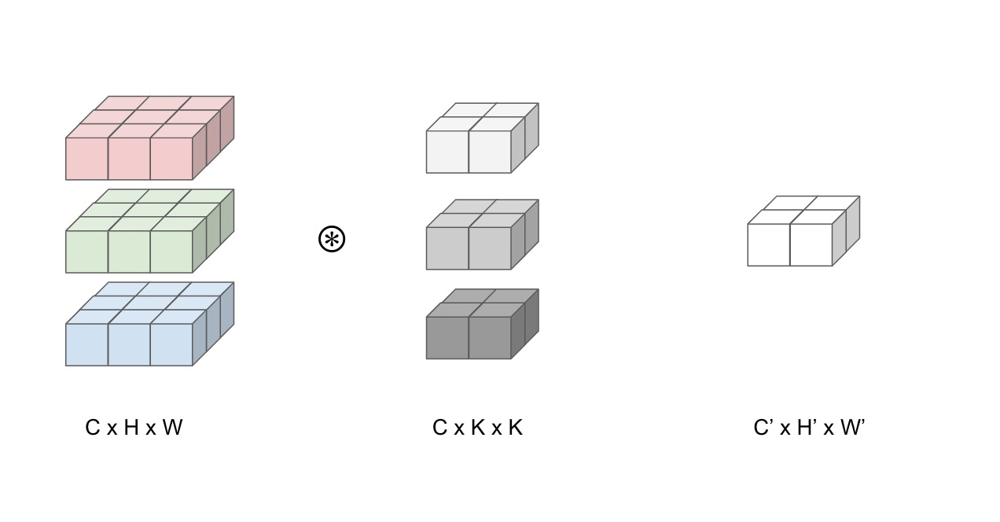
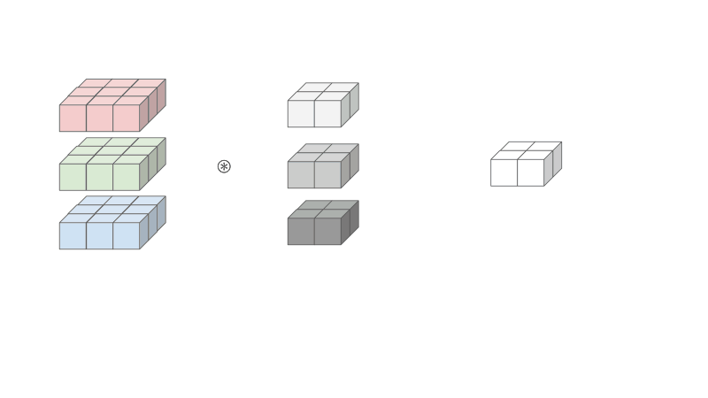

## Initial Thoughts

The computation pattern in training a convolutional network is very similar to matrix multiplication: it is both compute intensive and highly parallel.

convolution == 2d dot product == unrolled 1d dot product == matrix multiplication

It is pretty fun to think about, that everything we know in life decomposes to matrix multiplication, which we discussed in an earlier post (matrix multiplication is parallel) .. it is just lucky to have an official name. Now thinking about it - convolution is just a 2d dot product - can we all have a vote to call convolution matrix dot product? If we call an operation between two matrices that does a __multiplication followed by summation__ through collapsing one dimension __matrix "multiplication"__ - we should really call an operation between two matrices that does a __dot product followed by summation__ through collapsing one dimension __matrix "dot product"__ - it's only fair!

## Why do we care?

Let's think about convolution in the context of convolution layers in deep learning. Maybe we can use this idea to our advantage when parallelizing the computation of forward pass output in training and inference. The idea is that libraries for linear algebra are already super optimized to do matrix multiplication. So instead of implementing separate kernels to do convolution, we can simply convert convolution operations to a single matrix multiplication. This means that in order to convert convolution to a single matrix multiplication, we would need to unfold and duplicate the inputs to the convolutional kernel so that all elements needed to compute one output element will be stored as one sequential block. Due to these optimizations, __matrix multiplication benefits from the very regular patterns of memory access, which can outweigh the wasteful storage costs of duplicating the inputs__.

## Example

We are going to keep this example simple. From above, we have a convolution layer that takes the input as 3 feature maps (input channel C = 3) of size 3 x 3. Let's have the layer reduce the output to 1 feature map (output channel C' = 1) of size 2 x 2.

* Input: C x H x W = (3 x 3 x 3)
* Kernel: C x K x K = (3 x 2 x 2)
* Output: C' H' x W' = (H - K + 1) x (W - K + 1) = (2 x 2)

Let's see how we can convert this layer to one big matrix multiplication.

First notice how the both the input and the kernel is 3D. Well in order to use matrix multiplication, we would need to have a 2D input and a 2D kernel so we can treat both like a matrix. This leads to the flattening of the kernel and duplication of the inputs described below.

Reducing the kernel - each channel of the kernel will be linearized and concatenated shown in grey.

Reducing the input - the input elements needs to be rearranged and duplicated. Since the results of the convolutions are summed across input features, the input features can be concatenated into one large matrix. The __height__ of the unrolled input equals to the number of kernel elements, 12 in our case. The __width__ of the unrolled input equals to the number of output elements, which is 4 in our case.

## OK but why do we REALLY care...

 With deep learning networks increasing in size, increasing in computational complexity, as well as the increasing demand for realtime computation (self-driving cars, real time image processing ect), these convolution layers and its operations become the bottleneck in these fast system applications. So in order to optimize these convolution layers, would you rather optimize convolution or matrix multiplication? If you pick the latter, then yeah I agree, since matrix multiplication is something middle schoolers understand... It is much easier to tweak a matrix multiplication function in order to say optimize for speed or power through understanding the software implementation as well as how is it applied to hardware. In addition to optimizing the software such as linear algebra libraries, recent areas of research is actually done on the hardware, such as implementation of hardware accelerators to just do matrix multiplication. Wait, isn't that what a GPU is? yeah sorta. Let's just say that GPUs are just specialized hardware to do matrix multiplication prove me wrong.
