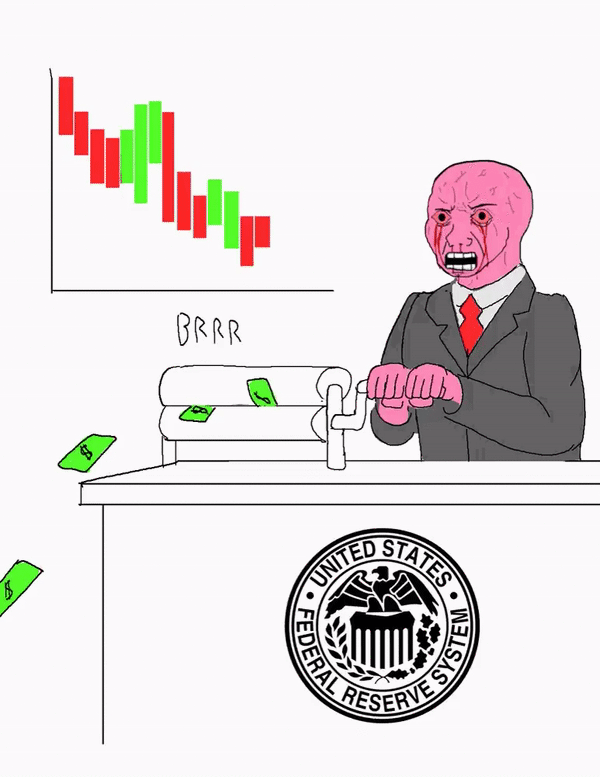

Working for aprox. half a year, still amidst adjusting to working full time, and BAM, I am told we are in an economic crisis. Great timing. I have come to the realization that the four years of college absolutely did NOT prepare me for having some understanding of the current economic / financial conditions and prospectives (and yes, I took micro and macro economics - don't remember much if at all).

Are we in a recession, a depression? Stock market crashed, but currently experiencing a recovery so everything will be ok? What does negative interest rate mean? US is in debt, how does that affect me? Why can the fed keep printing money for stimulus, quantitive easing, and potential universal basic income? Will this cause inflation? And more importantly, what should I do to navigate this potential recession. These are the questions that I wish I could answer as an "adult," but I am more confused than ever. The idea of not understanding the current state is even scarier than not knowing the future.

I decided that rewatching the movie The Big Short to prepare for this crisis will not cut it. This is why I picked up __Principles for Navigating Big Debt Crises__ by Ray Dalio.

I find the way this book present the information very straight forward, no fluff, the way it goes about describing the phases of the debt cycle almost algorithmic. This post is really for me, jogging down some key points and notes under the two main sections of deflationary vs inflationary debt cycle. However, if you are a tech person reading this and you are as oblivious to the economy / financial sphere just like me, then I hope you can get something out of this. In the end, I would like to draw some parallels to what is happening today to the debt cycle template because there does not seem to be a 1:1 mapping to either the deflationary nor the inflationary case presented.

* deflationary debt cycle
* inflationary debt cycle
* monetary policies
* analysis

## The classic deflationary debt cycle

> "In deflationary depressions, policy makers respond to the initial economic contraction by lowering interest rates. But when interest rates reach about 0 percent, that lever is no longer an effective way to stimulate the economy. Debt restructuring and austerity dominate, without being balanced by adequate stimulation (especially money printing and currency depreciation). In this phase, debt burdens (debt and debt service as a percent of income) rise, because incomes fall faster than restructuring, debt paydowns reduce the debt stock, and many borrowers are required to rack up still more debts to cover those higher interest costs. As noted, deflationary depressions typically occur in countries where most of the unsustainable debt was financed domestically in local currency, so that the eventual debt bust produces forced selling and defaults, but not a currency or a balance of payments problem." -- Dalio page 15

__Causes:__ investor optimism, bull run / market boom, over leverage, increasing debt to income (depends if concentrated in one sector or averaged out), failure of monetary policies to stop the trend and often they encourage it, because who wants to be the party pooper

__Cases:__ US (1928 - 1937), US (2007 - 2011)

| Phase        | Central Bank / Government Should Do This           | Don't Do This  |
| ------------- |-------------  | ----- |
| Bubble      | restrain debt growth, tighten fiscal policies| speculators over leverage, debt financed investments |
| Top      | use macroprutential policies to constrict bubble      |   tighten after bubble burst |
| Depression | lower shorts, aggressive monetization, provide liquidity, provide stimulus, protect important institutions    |    austerity, slow to action |
| Deleverage | balance the depressive forces of defaults and austerity with the reflationary forces of debt monetization, currency declines, and fiscal stimulus. Get nominal growth above nominal rates. Non-important institutions are allowed to fail.   | bailouts for everyone, even non important institutions. Print too much money and faith in currency collapse|

## The classic inflationary debt cycle

> "Inflationary depressions classically occur in countries that are reliant on foreign capital flows and so have built up a significant amount of debt denominated in foreign currency that can’t be monetized (i.e., bought by money printed by the central bank). When those foreign capital flows slow, credit creation turns into credit contraction. In an inflationary deleveraging, capital withdrawal dries up lending and liquidity at the same time that currency declines produce inflation. Inflationary depressions in which a lot of debt
is denominated in foreign currency are especially difficult to manage because policy makers’ abilities to spread out the pain are more limited." -- Dalio page 15

__Causes:__ currency weakness. not reserved currency aka dollars, low foreign exchange reserves, foreign debt, increase in deficit, capital flight

__Cases:__ Germany post WWI (1918 - 1924)

| Adjustments        | Central Bank / Government Should Do This           | Don't Do This  |
| ------------- |-------------  | ----- |
| manage currency      | surprise devaluation of currency, huge drop so ppl think its the bottom| dragged out devaluation, maket speculation worse to come causing high interest rates and inflation expectation |
| external balance      | incentivize investors to stay in currency     |  restrict capital outflow through regulation|
| smooth downturn | use reserved to slow down foreign capital withdrawal |    use reserve sales for spending |
| managing bad debt | work through debt and make up gap with credit   | allow disorderly defaults causing uncertainly and capital flight|

## Monetary policies

### #1. lower interest rates: affects behavior of borrowers and spenders

Create positive wealth effects (raise value of most investments), makes it easier to borrow aka buy things on credit (raise demand), reduce debt burdens (improve cash flow / spending). Typically the first approach to a debt crisis, but when short-term interest rates hit around 0 percent, it no longer works effectively.

> 

### #2. Quantitative Easing: affects behavior of investors and savers

Print money and buy financial assets aka debt. benefits people who own financial assets. basically buying assets frees up cash for investors can they can either invest in assets that finance spending (good for stimulating economy) or they can invest in assets that do not, which will take a while to trickle down. This option becomes less effective with higher prices and lower returns.

> 

### #3. Free money: affects behavior of spenders

Print money and put it into the hands of spenders (less wealthy) instead of investors / savers and incentivize spending. involves both fiscal (government policies / tax incentives) and monetary (central bank printing money) working together.

> 

## Analysis

Where are we in this cycle? First of all, let's look at the definition of the classic bubble.

#### Classic Bubble

1. Are prices high relative to traditional measures?
2. Are prices discounting future rapid price appreciation?
3. Are purchases being financed by high leverage?
4. Are buyers/companies making forward purchases?
5. Have new participants entered the market?
6. Is there broad bullish sentiment?
7. Does tightening risk popping the bubble?

All definition of the top of the bubble described end last year in 2019, it is clear that we are currently in the deleveraging process. During this time, the central bank and the US government are exercising the three monetary policies of lowering interest rate, qualitative easing, and free money mentioned above. You can see from the new headlines I included above that all three levers have been used. How the economy responds is still unclear at this time. Are we heading to a depression?

I think the answer is a YES. Ray Dalio defines a depression as real GDP falling by more than 3 percent in large countries, and GDP contracted by 4.8% first quarter of 2020. It seems like from history repeating itself, this time around we will enter a deflationary depression. But can the depression also be inflationary? While it is true that the US dollar is the world's reserve currency and that our debt is denominated in our own currency, there can be other factors such as inflationary policies at hand that potentially devalue the currency. Although this book never mentions if the US can be exposed to inflationary depressions, I did find this quote that clears a bit of confusion:

> "Can reserve-currency countries that don’t have significant foreign-currency debt have inflationary depressions? While they are much less likely to have inflationary contractions that are as severe, they can have inflationary depressions, though they emerge more slowly and later in the deleveraging process, after a sustained and repeated overuse of stimulation to reverse deflationary deleveraging. Any country, including one with a reserve currency, can experience some movement out of its currency, which changes the severity of the trade-off between inflation and growth described earlier. If a reserve-currency country permits much higher inflation in order to keep growth stronger by printing lots of money, it can further undermine demand for its currency, erode its reserve currency status (e.g., make investors view it as less of a store hold of wealth), and turn its deleveraging into an inflationary one." -- Dalio page 40

From a surface level, it seems the future of our economy hinges on the faith and value of the dollar. Every since 1971 when the US officially came off of the gold standard, the dollar quickly went from "money" --> "currency", where both are forms of exchange but only "money" has the property of "store of value." If we enter a state of deflationary depression followed by inflation with all three of the fed's monetary responses already in use, what is next? My guess would be Universal Basic Income, which involve more printing. In the end, it makes sense that the economy should be dictated by productivity and the creation of real goods and services, rather than debt. However, countries around the world that holds dollars still have faith, at least in the short term. To not believe in the dollar is like betting against america, and the common sentiment is to never bet against america. However, can real money with a store of value like gold and crypto act as a hedge against the potential risk of dollar devaluation and possibly the collapse of global fiat currency? I would say yes in our current phase. I think the biggest takeaway for me after reading this book is really a widened shift of paradigm. Zooming out of our current state captures more information and we can see the bigger picture of the long term debt cycle and the patterns that leads up to a eventual depression. And if we zoom out even more, we have the rise and fall of empires (Athens, Rome, ..) and there are scary similarities between patterns back then and the US today (debt, war, debased currency, inflation). I hope for the continual prosperity of the US, though history doesn't usually lie:

> _"History doesn't repeat itself but it often rhymes "_ - Mark Twain

Anyways, only time will tell, but here I leave you with a meme...

