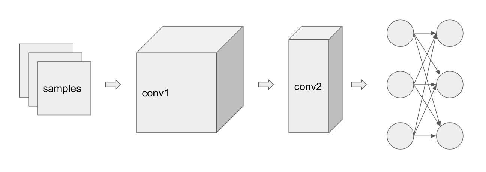
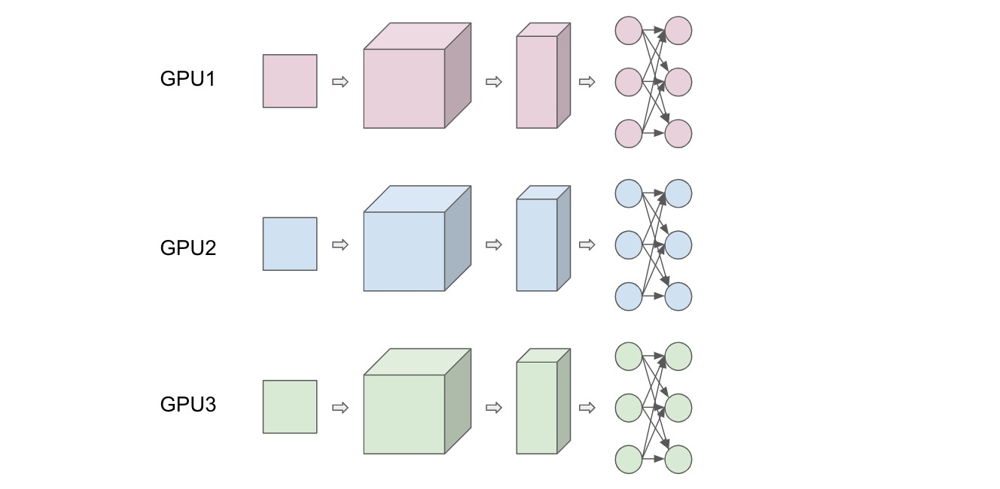
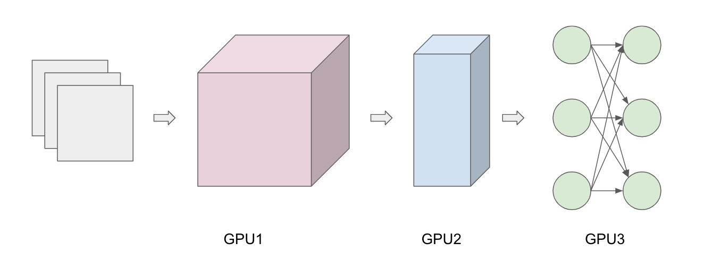

We all know that GPUs can speed up training time of neural network models over CPUs due to its parallel nature as kinda demonstrated from my previous post. Recently, a friend who read my post asked me...if training on GPUs is so effective, why don't you just have multiple GPUs and stack them up to accelerate training time? What he was referring to is known as multi-processor parallelism. This is similar to say, in High Performance Computing, applications can use a cluster of computing nodes, where each node can have many hosts (CPUs) and many devices (GPUs). Intuitively, this makes a lot of sense, more hardware resources means more computing power, which means less training time. But now the question is HOW can we efficiently distribute the work? What is the best way to split up the work load of training a deep neural network model onto multiple GPUs? Are there any inherent parallelism in the learning workloads? These are the questions that I could not answer...until now! We will investigate the three types of parallelism today:

* Data Parallelism
* Model Parallelism
* Pipelining

## Initial Thoughts

Training a neural networks is, surprisingly, a simple? problem. Stochastic gradient descent (SDG) with minibatches and its variants remain, at least for now, the most popular methods for training deep neural networks. When you ignore the fancy weight update functions/optimizers (adaptive learning rate, momentum, Adam ect.), SDG essentially becomes a forloop to calculate the gradients and update the weights. The bare bones of SDG for training a neural network literally looks something like this:

      for number of iterations:
          for samples in dataset:
              model.forward
              loss.backward
              new weights <- old weights - learning_rate * gradient

Below is the above algorithm with a more mathy notation:

__for__ $t = 0$ to $T$ __do__  
  &nbsp; &nbsp;  $s \larr$ random element from $S$  
  &nbsp; &nbsp;  $f \larr f(w^t, s)$  
  &nbsp; &nbsp;  $l \larr l(f, h(f))$  
  &nbsp; &nbsp;  $w^{t+1} \larr w^t - \eta \cdot \Delta l(w^t, l)$  
__end for__

$S$ is training dataset, $f(w^t, s)$ is model forward function, $h(f)$ is the ground truth label, $l(f, h(f))$ is per sample loss function, $\Delta l(w^t, l)$ is the gradient of loss w.r.t the weights, and $\eta$ is the learning rate.

You have the training dataset that consists of some number of samples. Each sample contributes to the gradient in a small way. We can update the weights after a single sample, or we can compute the average gradients contributed from each sample in a group of samples (minibatch), and then update the weights for each minibatch by simply taking a step in the negative direction. Usually, updating after each minibatch is more stable than updating after each sample because taking the average of the gradient reduces the variance of the gradient estimate. Now, you are probably wondering why can't the minibatch size can be the whole training input, so you can update the weights once for the whole dataset (batch gradient descent). The answer is usually we are limited by memory, aka, the entire dataset will probably not fit in memory if we want to do it all in one pass. All this talk about SDG and its variants may be confusing, let me clear things up a bit through the summary below:

#### Quick Summary of SDG

##### Stochastic Gradient Descent - updates weights after EACH sample
* more frequent updates may result in faster convergence
* more frequent updates is also computationally expensive
* each update is noisy..may be good for getting out of local minima
* noisy = larger variance = non optimal convergence

##### Batch Gradient Descent - updates weights after ALL samples in dataset
* fewer updates = better computational efficiency
* fewer updates = more stable convergence since each update is a better approximation of true gradient
* Stable can also mean premature convergence :( rip
* no memory to fit whole dataset

##### Minibatch Stochastic Gradient Descent - updates weights after a MINIBATCH of samples
* best of both worlds of the 2 variants above
* but need to have a hyper parameter of minibatch size

In the end, minibatch SGD is the most prominently used in deep learning training. So let's assume that the "samples" in the above training pseudo code is minibatch. Therefore, we are simply looking at parallelizing the inner forloop by partitioning the input samples. To be honest, we don't have much to work with. This leads to the first of the three types of parallelism techniques below, called data parallelism.

Let's say we have 3 samples and we have 3 GPUs to utilize. The model has some convolution layers and linear layers shown below. Let's see how we can divide up the work into the 3 GPUs, GPU1, GPU2, and GPU3.

## Data Parallelism

From the training pseudo code above, it is easy to see that a straight forward approach to parallelize the forloop is by processing different groups of minibatch samples on different GPUs. This is similar to the idea of using minibatch gradient descent, but scaled to multiple GPUs. So then it is easy to see that the scaling of data parallelism is naturally defined by the minibatch size. However, disclaimer: setting the minibatch size is actually not a trivial problem, as setting it too small will ruin the inherent concurrency in the evaluation of the loss function, and setting it too large beyond a certain point will decay the quality of the result. Another approach for data parallelism is ParallelSDG where SDG is ran in parallel, dividing the dataset on multiple GPUs. After convergence of all SDGs, we average the weights of each instance of SDG to obtain the update weight. In the end, the idea of data parallelism is about partitioning the input samples.

## Model Parallelism

Data aside, we can also look at the inherent structure of our model to look for parallelism. This strategy divides the work according to the neurons in each layer, basically breaking our model across each GPU, which has the benefit of conserving memory since the full network is not stored in one place. However, this also requires extra synchronization and communication after each layer. Each minibatch is also copied to each GPU.

## Pipelining

You have probably heard about pipeline relating to computer architecture (5-stage pipeline) where multiple instructions are overlapped during execution. To draw the analogy, each sample in our case is an instruction and each layer is a stage in the pipeline. Basically, each GPU is assigned to and processes a layer. Since each layer depends on the previous layer, we can pipeline it. We can view this method of pipelining as a combination of data parallelism and model parallelism since the samples are processes in parallel as they are fed into the pipeline (data parallelism), while the depth of the pipeline is determined by the number of layers in the model (model parallelism). Below demonstrates the basic idea of pipelining, note the increase in time slices when you don't pipeline.

#### With Pipeline

      sample 1:     GPU1  GPU2  GPU3
      sample 2:           GPU1  GPU2  GPU3
      sample 3:                 GPU1  GPU2  GPU3
      time:           1     2     3     4     5

#### Without Pipeline

      sample 1:     GPU1  GPU2  GPU3
      sample 2:                       GPU1  GPU2  GPU3
      sample 3:                                         GPU1  GPU2  GPU3
      time:           1     2     3     4     5     6     7     8     9

There are several advantages for a multi-processor pipeline over both data and model parallelism. First, parameters can be split up during forward evaluation and back propagation, unlike model parallelism. Second, the input and outputs of each processor is known. Finally, since each GPU always compute the same layers, the weights can remain cached. The main disadvantage is that each stage in the pipeline need to have similar compute rate to ensure that each sample can arrive at the next stage at the same time.

## Conclusion

As datasets increase in size, it is clear that concurrency and parallelism is crucial for accelerating training and inference computations. We can see that with more hardware resources, it is not simply expanding the parallelism at the level of abstraction of a single GPU (parallel threads) to multiple GPUs. Parallelism in deep learning initially seem like a simple problem, like parallelizing a simple forloop in data parallelism, but we can also see that there are inherent properties of deep learning models that also leads to model parallelism and pipelining. In terms of parallelizing deep learning, the trend nowadays seems to be focused on the tradeoff between speed and accuracy: how can we push the boundary of parallelism, while maintaining a reasonable accuracy?

## Resources

* Demystifying Parallel and Distributed Deep Learning: An
In-Depth Concurrency Analysis https://arxiv.org/pdf/1802.09941.pdf
* Integrated Model, Batch, and Domain Parallelism in Training
Neural Networks https://arxiv.org/pdf/1712.04432.pdf
