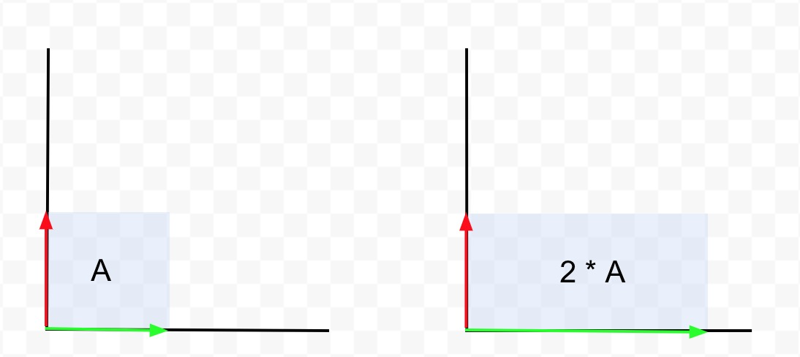

Does hearing eigenvalue or eigenvector trigger you? Have you ever solved for one, but didn't know what you were solving? Have you blindlessly used this equation:

$\det (A - \lambda I) = 0$

to solve for some eigenvalues, but never knew where the equation came from? Well, this post is clearly for you!

I was first introduced to these terms in my differential equations class. I remember memorizing the equations and passing my exams, thinking that it would be my last time seeing these eigen terms. However, I realized that they still come up everywhere, such as in transformations in Computer Graphics and analyzing data in Big Data... one literally cannot avoid them. So here is my take on explaining the equation above, in probably a nonorthodox way.

On a side note, eigenvalue and eigenvector always sounded intimidating for me, and I think it's because eigenvalue/eigenvector combines german and english, so it always sounded like a proper noun with no meaning. But actually, __eigen__ means special or unique in German. So all this time, you have been solving these special little snow-, I mean special values and special vectors.

### Definition:

$A \vec v = \lambda \vec v$

* $A$ is a matrix
* $\vec v$ is the __eigenvector__
* $\lambda$ is the __eigenvalue__

Reading this equation from left to right: when you apply a matrix $A$ to a vector $\vec v$, the resulting vector is equal to some scalar $\lambda$ times the same vector $\vec v$. In other words, after a transformation by matrix $A$ on a space, say in $R^3$, out of all the vectors in the space that are transformed by matrix $A$, there are some special vectors called _eigenvectors_ that do not change direction, but are rather made longer or shorter by a scalar value called the _eigenvalue_.

### Proof

We all know that the equation $\det (A - \lambda I) = 0$ is used to solve for the eigenvalue, and then using that to solve the eigenvectors. But, where did this equation come from? Well here is the proof I think makes sense intuitively, but keep in mind that it might not be a mathematically rigorous proof with all its technicalities...

* $A \vec v = \lambda \vec v$

This is the definition that we are starting with. As explained above, the left hand side produces a vector, and so does the right hand side. Keep in mind that __$\vec v$ is non-trivial__, which means that it does not equal the zero vector, which we know is always a solution.

* $A \vec v - \lambda \vec v = \vec 0$

Simply subtracting the right hand side over. Keep in mind that the difference of two vectors is a vector. So this is why the right hand side is the zero vector. It is basically a vector of zero length. So in $R^3$, the zero vector $\vec 0 = (0, 0, 0)$.

* $A \vec v - \lambda I \vec v = \vec 0$

I added the identity matrix $I$ as $\vec v = I \vec v$, so adding it doesn't really change anything, except now I can factor out $\vec v$. Keep in mind that $I$ has the same dimension as $A$.

* $(A - \lambda I)\vec v = \vec 0$

Just factoring.

* $M\vec v = \vec 0$

Since $(A - \lambda I)$ is just a matrix, let's call it matrix $M$ for now. So this step is substituting $(A - \lambda I)$ as $M$. This will help us understand the next step better. Let's read the above equation from left to right. When we apply matrix $M$ to vector $\vec v$, the resulting vector is the zero vector $\vec 0$. In other words, the matrix $M$ when applied as a transformation, collapses the dimension of the $\vec v$, or in technical terms, __$\vec v$ is an element of the Null Space__ of $M$. The Null Space is all the vectors, say for example in $R^3$, that are transformed into the zero vector after applying the transformation $M$ to $R^3$.

Since the NULL Space of M is not empty, __We can say that $M$ has linearly dependent columns__. Keep in mind the columns are the basis vectors. We know that $M$ is linearly dependent because we assume that __$\vec v$ is non-trivial__, so it cannot be the zero vector. We can see that after matrix $M$ is applied to some space, dimension is lost, or in technical terms, rank is reduced.

* $\det(M) = 0$

Ok so here is the crucial portion. First let's understand what taking a determinant of a matrix means. __The determinant of a matrix M is a scalar value that describes by what factor the "area" scales after transformation M is applied__. The "area" is defined by the basis vectors of the original vector space, if we are in $R^2$. If we are in $R^3$, then it would be the delta "volume" defined by the basis vectors. So the determinant of a matrix of $M$ tells me how the basis vectors of the space are changing after $M$ is applied. For example, the determinant of a matrix is 2, if the "area" changes by a factor of 2.

#### example:

Left graph is the original space defined by the green $i$ and the red $j$ basis vectors. Right graph is the space after applying transformation $M$. You can see that the area scales by a factor of 2 after applying $M$, and you can see that the determinant of $M$ is also 2. It is not a coincidence.

 $M$ = $\begin{bmatrix} 2 & 0 \\ 0 & 1 \end{bmatrix}$

 $\det(M) = 2$

So when the determinant of a matrix $M$ is zero, then it means that the area or the volume becomes zero, which means that when the transformation matrix $M$ is applied, the basis vectors of the space overlaps, so that the "area" they trace out is zero. This also means that transformation $M$ collapses the dimensions of the space, since the dimension is defined by the number of basis vectors.

So __if the determinant of a matrix $M$ is zero__, then this tells me that the columns (basis vectors) of __$M$ is linearly dependent__, and vise versa, since the basis vectors overlaps and the space is collapsed. It is also why we check to see if a matrix is invertible, by checking if the determinant is zero. When the basis vectors overlaps, we cannot know the inverse transformation matrix that will bring us back to the original vector space.

Since we know that $M$ is linearly dependent from $M\vec v = \vec 0$, then we can finally make the connection that $\det(M) = 0$.

* $\det (A - \lambda I) = 0$

Simply substituting $(A - \lambda I)$ back from $M$.
