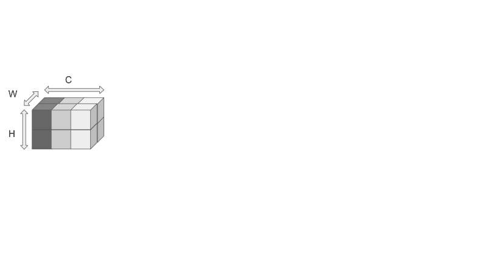

Did you know that all fully connected layers in neural networks can be replaced with convolutional layers? This means that networks that first applies convolutional layers, and then applies fully connected linear layers, can be made fully convolutional. Or in other words, a MLP can be represented by convolution layers only.

Now this was news to me because I always thought linear layers and convolutional layers to be different, with different input types, weights, and outputs, as well as the idea that convolution is meant to do feature extraction, while fully connected layers is meant to do classification.

However, linear and convolutional layers are almost identical functionally as both layers simply computes dot products. The only difference is that the neurons in the convolution layers are connected to a local region and that parameters may be shared. Therefore, it is very easy to convert fully connected layers to convolutional layers.

Let's see how this conversion is done. Let's say that we have an architecture consists of first convolutional layers and then fully connected layers. Let's say that in the forward pass, the output of the convolutional layers is a tensor of shape __H x W x C__, where H indicates height, W indicates width, and C indicates number of channels or the number of feature maps. If we want our next layer to be fully connected with a size of __3__, then this layer can be replaced by a convolution layer with __filter = C x H x W, Padding = 0, stride = 1, output channel = 3.__ In other words, we are setting the filter size to be exactly the size of the input volume. Each filter contributes to exactly __one__ output and that there are 3 filters total to produce an output of __1 x 1 x 3__.

Now let's visualize how these two layers produces the same outputs. Let's say that the input to the layers is a tensor of H x W x C, where H = 2, W = 2, and C = 3.

## Fully Connected Layer

In the fully connected layer case, the input is first flattened to a tensor of size 12. The yellow, blue, and pink tensors represent the weights, each of size H * W * C, where through the dot product plus some bias produces a final output of 3 neurons.

## Convolution Layer

In the convolution layer case, the yellow, blue and pink tensors represent the filters, each of size H x W x C. A single neuron is produced by convolution. Since there is no sliding of the filters, this convolution operation is essentially the dot product, just like in the fully connected layer case. Since there are 3 filters, 3 neurons are produced.

## Example

Let's take the AlexNet for example, where the last three layers are linear. The input to the first linear layers is __6 x 6 x 256__. Let's convert the three linear layers in the original to convolutions. Keep in mind the conv2d notation is conv2d(in\_channel, out\_channel, kernel_size = (a,b)). Also, a kernel is __one__ channel of a filter. So the filter here defined by the conv2d(in\_channel, out\_channel, kernel\_size = (a,b)) has __filter size__ of kernel\_size * in\_channel.

    Original:                       Converted:                                   

        convolution layers...           convolution layers...

        1. dropout                      1. dropout
        2. linear (9216 -> 4096)        2. conv2d(256, 4096, kernel_size = (6,6))
        3. relu                         3. reLU
        4. dropout                      4. dropout
        5. linear (4096 -> 4096)        5. conv2d(4096, 4096, kernel_size = (1,1))
        6. relu                         6. relu
        7. linear (4096 -> 1000)        7. conv2d(4096, 1000, kernel_size = (1,1))

## Why convert to convolution?

So now that you know how to convert linear layers to convolutional layers, you are probably asking why do people do it if in terms of functionality they are the same. Well, this conversion to convolution does not change anything if the input size is such that the output has a single spatial cell, which is in the example above as the input was 6 x 6 x 256, and then the convolution filter is 6 x 6 x 256. However, if the input is larger than the filter, then we are able to to “slide” the filter very efficiently across many spatial positions in a larger image. So the convolution fully __re-uses computation__ to get a prediction at multiple locations when the input is larger.

What does this mean? Well in the example above, before the first linear layer, there are many earlier layers in the forward pass not shown, denoted by "convolution layers..." above. Now if we have a large image, and we want to use different crops of the large image to train, instead of cropping the large image to multiple standard input size and feeding these smaller crops into the start of the network, we can actually feed in the large image, and "crop" once we get to the "linear" layers. The converted convolution layers will be able to slide across the bigger image, and provide class scores on each "crop." This means that the "convolution layers..." in the forward is computed a __single__ time, making it much more computationally efficient than iterating through each crop of the original large image at the beginning and feeding each crop through the entire pipeline.

Moreover, this “convolutionization” has a practical consequence, as we can now re-use classification networks for dense prediction without re-training. This means that we keep the trained weights for the first "convolution layers..." and then train only the final "linear" layers. Finally, this conversion from linear to convolution layer blurs the conceptual boundary between “features” and “classifier” and leads to an intuitive understanding of convolutional network activations as gradually transitioning from appearance to semantic. This leads to the topic of semantic segmentation, which deep fully convolutional networks can achieve in one pass. Although semantic segmentation is a very cool topic, this post is getting too long, so I will save it for next time! Thanks for reading!
