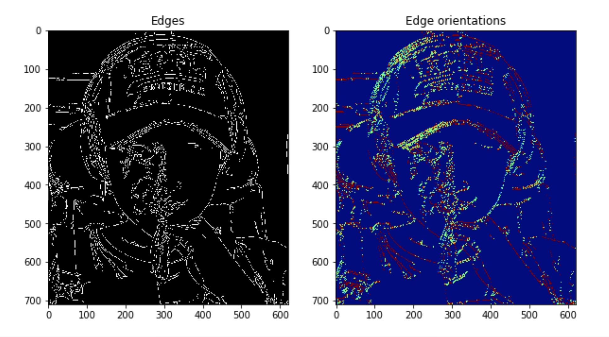
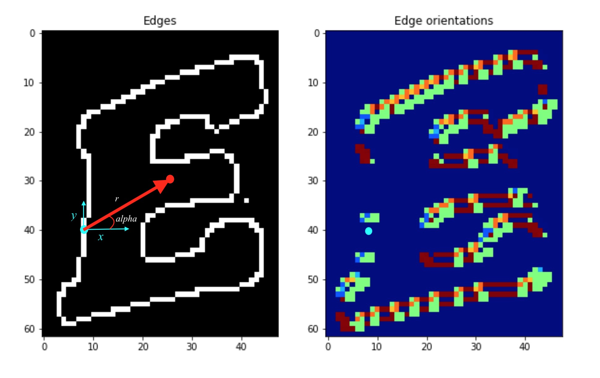
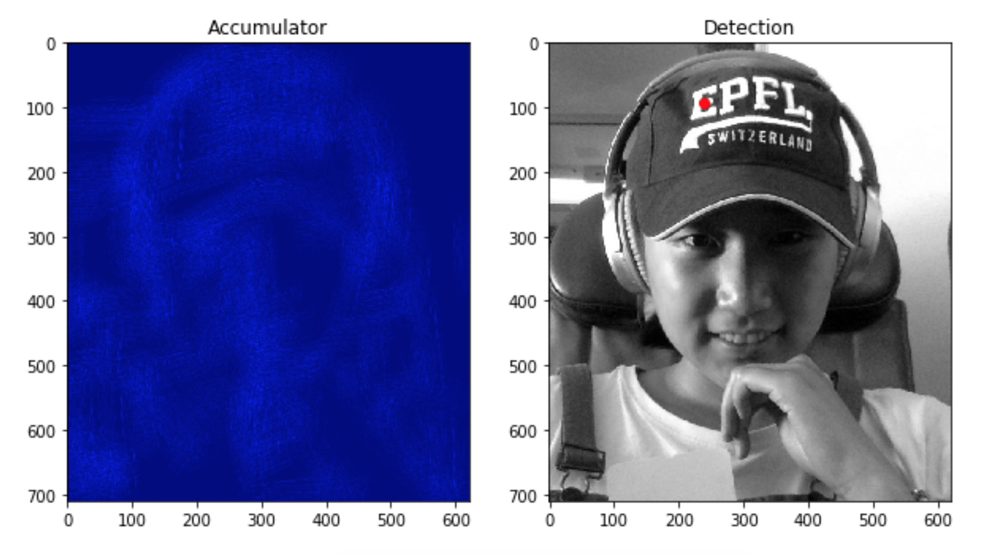

Have you ever wondered how lines or shapes can be detected from images? Well, before the times of Machine Learning and deep networks where the neural network somehow extracts the features and makes sense of it, a more mathematical approach was used. Actually, I don't know why I am using the past tense, because this method is still widely used in image processing and computer vision to detect features, objects, or shapes of any type. This is the method that we will explore today, and it is called the "Generalized Hough Transform."

Ok actually, "Generalized Hough Transform" kind of sounds intimidating. The name sounds like Fourier Transform or Laplace Transform and when the word "transform" is attached, I get a mini heart attack thinking about the conversion tables and properties that need to be memorized. However, I can assure you that the "Generalized Hough Transform" is essentially just template matching and the algorithm really doesn't involve anything complex.

The generalized Hough Transform, as the name suggests, is really a generalization of the __Hough Transform__, which was initially developed to detect analytically defined shapes such as lines, circles, and ellipses. For example, in the case of a line, the main idea is to transform points in the image space into lines in the "transformed" space. The intersection of many lines (a point) in the transformed space defines a lines in the image space. I will not go over this specific case, but it will help you understand the generalized Hough Transform better if you understand the specific line case.

## What's the point?

Let's say I have an image, let's call it the __target image__. Below is an image of me on my flight back to the US from Switzerland. What's a better way to spend the 7 hours than to write about the Hough Transform? :)

I also have a __template image__. The template is the shape that I want to find in the above image. This template for this example is an upper case E from my cap.

Now I want to know the location (x-y coordinate) of the uppercase E in the target image. You are probably thinking that this task is super easy. It is obviously the first letter on the cap in the upper left corner of the image. However, this task might not be this easy for a computer as the template E is an arbitrary shape, so this is when the generalized Hough Transform comes in!

## Algorithm

* Step 1: preprocess both images (find edges and their orientation)
* Step 2: specification of template shape (compute r-table)
* Step 3: find (accumulate) all the possible locations of template on image and find most frequent center

### Step 1: preprocess both images

A key feature that defines a template or shape is the contour or the edges, so it makes sense that the computer needs to find the edges in order to make sense of a shape. An edge in an image can be found through computing the __gradient__. You can think about the gradient as a vector with a magnitude and direction. The magnitude of the gradient tells us how "sharp" the edge is, so a greater magnitude corresponds to an "edgier" pixel. The direction of the gradient tells us the __edge orientation__ since the edge orientation is perpendicular to the gradient direction. So for example, you can think of edge orientation as: does this edge pixel corresponds to a horizontal edge or vertical or maybe a 45 degrees edge?

Since we are working with edges, we have to first convert the template and target image to both greyscale images. Then we can use the "Canny" edge detection algorithm to find the edges. In order to find the edge orientations, we can use the Sobel filters to first compute the gradient in x and y directions at each edge pixel. Then we can find the orientation by computing the arctan of dx and dy, so that each pixel in the edge orientation map is between [0, 2$\pi$].

    def find_edge_orientation(image):

        dy = sobel(image, axis=0)
        dx = sobel(image, axis=1)
        edge_orientation = np.arctan2(dy, dx) + np.pi  # +np.pi ->  grad orientation is in the rage [0,2*pi]

        return edge_orientation

### Step 2: specification of template shape (r-table)

Now that we have the edge map and the edge orientation map of both the target and template images, we need to use this information to define the shape of the template. The main idea here is that we want to eventually differentiate the specific template that we want to find in the target image with other possible shapes. Therefore, we need to __parametrize__ the template that defines the shape so that it would be unique enough to not be confused with other potential shapes. A good way to parametrize this template is to use the vector from each edge pixel to an arbitrary center point $(x_c, y_c)$ of the template. The vector is the information we need, which has a magnitude $r$ and direction $\alpha$, both which can be calculated from the edge map of the template. Finally, we should organize each pixel edge's information by its orientation, which we have from the template edge orientation map.

In other words, we are computing the __r-table__. As the name suggest, it is a table in which each row corresponds to an edge orientation. Each entry in the table represent an edge pixel location $(r,\alpha)$ with respect to a center point. A single row in the table can have multiple such entries. When inserting a new entry  $(r,\alpha)$ representing an edge pixel, we first find the orientation of that edge pixel. Then the orientation is used to find the row in the table and  $(r,\alpha)$ is appended to the entries in that particular row. Since the r-table's index is discrete, you can choose how many types of edge orientations to store since the values of the orientation map is between 0 and 2$\pi$, so we can break that into (row_count) values shown in the python code below.

* $r = \sqrt{(x_c - x)^2 + (y_c - y)^2}$

* $\alpha = tan^{-1}({y_c - y \over x_c - x})$

In the left image above, the red point indicates the arbitrary center point $(x_c, y_c)$. The blue point indicate an edge pixel. If you look at the same blue edge pixel in the edge orientation map, the value at that edge pixel is zero. This is because the edge pixel's orientation is "vertical". So for each blue point (edge pixel), there is a $r$ and $\alpha$ value pair that defines the red vector, and the $(r,\alpha)$ is the information stored in the r-table.

    def build_r_table(template, center_point, row_count):

        edges = canny(template)
        orientations = find_edge_orientation(edges)
        r_table = [[] for i in range(row_count)]

        for (i, j), value in np.ndenumerate(edges):
            if value:

                r = np.sqrt((center_point[0] - i) ** 2 + (center_point[1] - j) ** 2) # compute r
                alpha = np.arctan2(i - center_point[0], j - center_point[1]) + np.pi # compute alpha

                index = int(row_count * orientations[i, j] / (2 * np.pi)) # compute row index in the table

                r_table[index].append((r, alpha)) # append the value to R-table

        return r_table

### Step 3: find (accumulate) all the possible locations of template on image

Now this step is the actual step that will find the location of the template. The main idea is that we will look at all the edge pixels in the __target__ image, where each edge pixel will have an edge orientation. Now all we have to do is to look up that specific orientation in the r-table which will lead us to the $(r,\alpha)$ pairs. Each $(r,\alpha)$ will tell us a "candidate center point" and will contribute to one "vote" to that candidate center point. The candidate center point is easily calculated since we have the edge pixel coordinate $(x, y)$ and we have a magnitude and direction indicated by $(r,\alpha)$.

* $x_{candidate\_center} = x + r * cos(\alpha)$
* $y_{candidate\_center} = y + r * sin(\alpha)$

    def compute_accumulator_array(target_I, r_table):

      edges = canny(target_I)
      orientations = find_edge_orientation(edges)
      accumulator = np.zeros(target_I.shape)
      r_table_row_count = len(r_table)
      vals = []
      for (i, j), value in np.ndenumerate(edges):
          if value: # edge check

              index = int(r_table_row_count * orientations[i, j] / (2 * np.pi))

              r_row = r_table[index]
              for (r,alpha) in r_row:

                  # finding correct position to vote
                  accum_i = int(i + r * np.sin(alpha))  # y cordinate
                  accum_j = int(j + r * np.cos(alpha))  # x cordinate

                  # outofbound check and vote
                  if accum_i < accumulator.shape[0] and accum_j < accumulator.shape[1] and accum_i > 0 and accum_j > 0:
                      accumulator[accum_i, accum_j] += 1

      return accumulator

The accumulator has the same dimensions as the target image and it shows how many "votes" each location got. The lighter the pixel, the greater the value, which means the greater the possibility of the location being the actual center. Therefore, in order to find the best matched center location, we simply find the location with the greatest value in the accumulator map. You can see from the detection image indicated by the red dot is the best matched center for the template. Multiple occurences of the shape can be found by not just looking at the greatest value in the accumulator, but looking at top-k values to find k locations. It is nice that this can be done in one pass of the algorithm.

## Conclusion

As you can see, the generalized Hough Transform can be used for __object recognition__. An advantage is that this algorithm can be used on any arbitrary shape since we only have to parametrize the contour of the shape. Moreover, this algorithm can be extended to compute multiple scales of the template shape by simply storing multiple scales of $r$ of the $(r,\alpha)$ in the r-table. As you can see in the example above, even with a noisy target image and a non standard template (upper E not a standard shape consisted of straight lines), the result was accurate. A draw back is that it requires a lot of storage and extensive computation when computing the accumulator. However, writing parallelizable code can alleviate the computational complexity. I suggest trying this algorithm out with different images and templates and see how well the algorithm performs! The python code provided should be enough for you to get started, so have fun!
