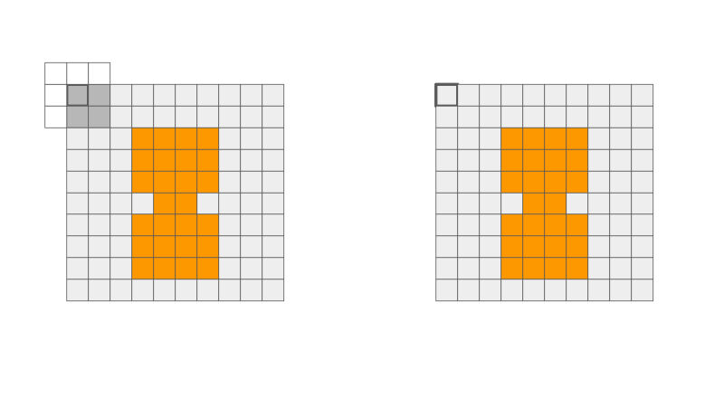

## Mathematical Morphology

Mathematical morphology uses set theory to describe shapes. In image processing, operators from mathematical morphology can be used to pre-process or post-process images. The basic four morphological operators are dilation, erosion, opening, and closing. All operations involve an __structuring element__, and the result of each operation really describes the interaction between the input image and the structuring element. These operations are also usually performed for binary images. There are functions defined in OpenCV that applies these four operations. I will include these functions below, as they are super easy to use. You only need two inputs: the input image and a structuring element. Definitely play around with them, but the visualization below shows you exactly what each operation is doing.

In the examples below, the structuring element is 3 pixels by 3 pixels. You can think of it as a filter or kernel, similar to convolution. An _anchor_ is defined for each structuring element that maps to each pixels of the output. In openCV, you can specify the size of the kernel, such as a 5x5 kernel (assuming background is 0 and foreground is 1):

    kernel = np.ones((5,5) , np.uint8)

In the visualizations below, the left image is the input image, and the right image is the output as the structuring element is slid across. Each box represents a pixel. An orange pixel represents a pixel in the foreground (1 in binary), while a grey pixel is part of the background (0 in binary). The final output is displayed when the structuring element has slid through all the output pixels.

## Dilation

This operation "dilates" the shape in the image. This means that it can smooth out some nooks and crannies in the original image shape. This operation is associative as well as commutative!

When sliding the structuring element, each output pixel that was originally in the background (grey) can either stay grey or turn into the foreground (orange).

__Rules:__

* Any overlap of structuring element and orange pixels, output turns orange.
* No overlap of structuring element and orange pixels, output stays grey.

    dilation = cv2.dilate(input_img, kernel , iterations = 1)

## Erosion

This operation "erodes" the shape in the image. This means that it can smooth out rough edges in the original image shape. The idea is that a foreground pixel will remain if you can fit the whole structuring element anchored at that pixel. This operation is not associative nor commutative!

When sliding the structuring element, each output pixel that was originally in the foreground (orange) can either stay orange or turn into the background (grey).

__Rules:__

* Full overlap of structuring element and orange pixels, output stays orange.
* Else, output turns grey.

    erosion = cv2.erode(input_img, kernel , iterations = 1)

## Opening

__First apply erosion, then apply dilation!__ This operation is useful for removing noise. This is because the first erosion will remove any shape in the original image that is smaller than the structuring element, but also shrinking the shape that we want. Then, the dilation will reverse the shrinking, but it will not bring back the "noise."

    opening = cv2.morphologyEx(input_img, cv2.MORPH_OPEN, kernel)

## Closing

__First apply dilation, then apply erosion!__ This operation is useful for "closing" holes in the shape that we want, or foreground. This is because when we first apply dilation, the holes will be closed, but the main shape will enlarge. Then the erosion will reverse the enlargement of the main shape, so the effects of closing really is just "closing" the holes.

    closing = cv2.morphologyEx(input_img, cv2.MORPH_CLOSE, kernel)

## Bonus round

If you want to think about the duality of dilation and erosion, then you can say that dilating the “foreground” is the same as eroding the “background”, and likewise, eroding the foreground is the same as dilating the background! So each operation is the set compliment of the other, with reflecting structuring element! Mind == blown?
