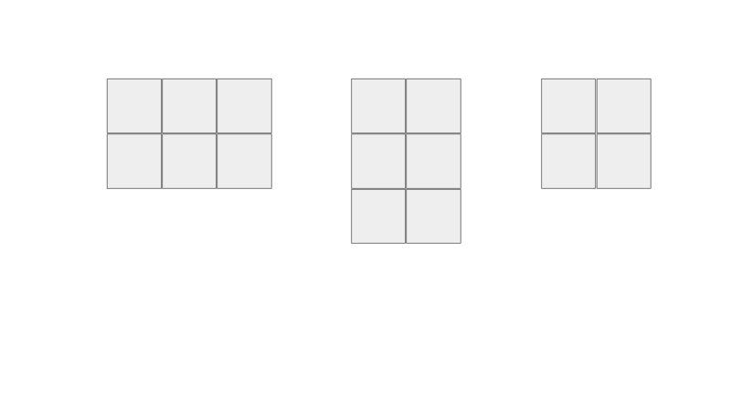
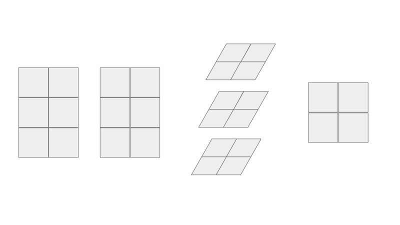

Everyone knows how to compute matrix multiplication. But what are we exactly doing with this operation? I want to introduce my way of viewing matrix multiplication, a way that is intuitively parallel.

I was introduced to this view of matrix multiplication, inadvertently, when I was writing a backwards pass for a deep learning model. If you have ever written one from scratch, you might understand the amount of reshape, transpose, and summing necessary to manipulate the tensors so that the dimensions match. At first, I was able to get one sample, a 1d feature vector, to work with the backwards pass to calculate the change in gradients, a tensor. After that, I started to implement mini batch gradient decent, which means that the operations done on each sample of the mini batch are the same, but I just had to sum up all the tensors produced by each sample to find the total change in gradients produced by each mini batch. I knew at that point that I can simply use a for loop to sum up the resulting tensors from each sample, but I thought there must be a better way... If you have no idea what I am talking talk, don't worry because it is not important. It is just my reflection of how I got that "ah-ha" moment!

Let's say we have two matrices that we want to multiply together:

      Matrix A (2x3):            Matrix B (3x2):

        1  2  3                       7  10
        4  5  6                       8  11
                                      9  12

## Most people's view:

So I am sure that if you are reading this, you know that in order to compute A x B, let's say matrix C, we take the each row of A and each column of B and compute the dot product to get the resulting matrix.

      Matrix C (2x2):

      1 * 7 + 2 * 8 + 3 * 9 = 50        1 * 10 + 2 * 11 + 3 * 12 = 68
      4 * 7 + 5 * 8 + 6 * 9 = 122       4 * 10 + 5 * 11 + 6 * 12 = 167

      50   68
      122  167

## My view:

Le't transpose matrix A such that A and B has the same number of rows.

      Matrix A (2x3):            Matrix B (3x2):

        1  4                         7  10
        2  5                         8  11
        3  6                         9  12

For every row, a 2x2 matrix is created through matrix multiplication. Since each row is a 1x2 vector, we transpose each row from A to get 2x1. So each row from A (2x1) multiply each row from B (1x2) creates a 2x2 matrix.

    Row 1:  7   10
            28  40

    Row 2:  16  22
            40  55

    Row 3:  27  36
            54  72

Now we can collapse the three matrices into one matrix, by summing up component-wise through each row.

    Matrix C (2x2):

    7 + 16 + 27 = 50        10 + 22 + 36 = 68
    28 + 40 + 54 = 122      40 + 55 + 72 = 167

    50   68
    122  167

As you can see, the resulting matrix C is the same! But now can you see where the parallel intuition comes from? In this view, can you see that the creation of the blue intermediate matrices are independent of one another? Each row of A and each row of B contributes to __one__ blue matrix. This means that the computation of each blue matrix can be done in parallel. Each component in the resulting green matrix can also be summed in parallel.

## My thoughts:

If we view matrix multiplication my way, then it is really an operation (matrix multiplication) done on each row, which produces a row number of units, which then is collapsed through summing to produce the resulting matrix. If we change that operation done on each row to, let's say, the dot product, then the row number of units become scalar, and the final result will be the sum of these scalars. However, this operation does not have an official name like "matrix multiplication." If it did, it would probably be called "matrix dot product." This can be said for any operation done on each row of matrix A and matrix B to compress some information a long as A and B have the same number of rows. So how I think about matrix multiplication is that it's just a special case of this type of operation with its own name!
