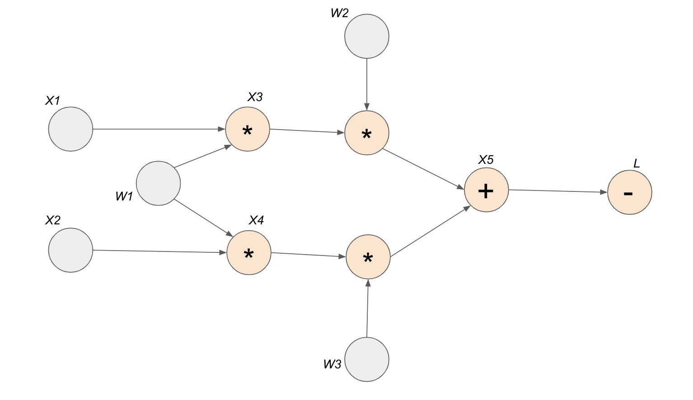
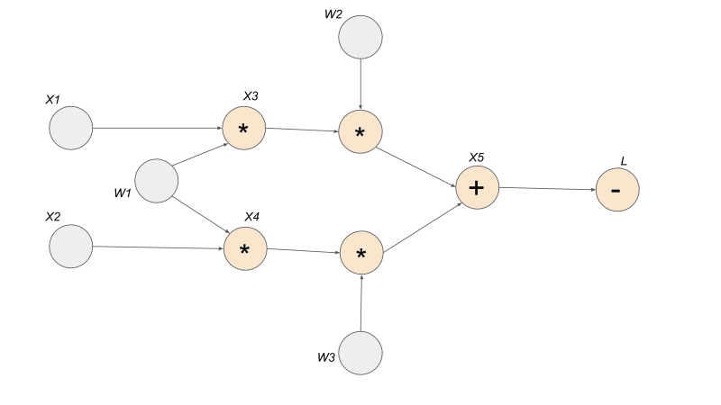
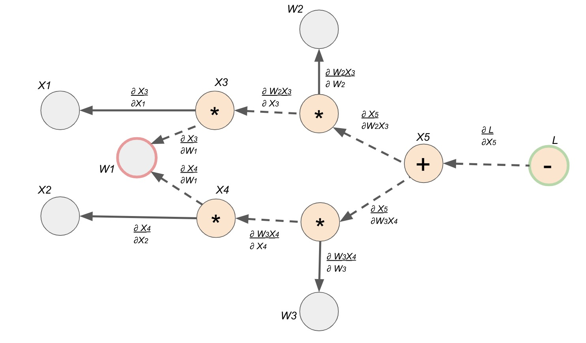
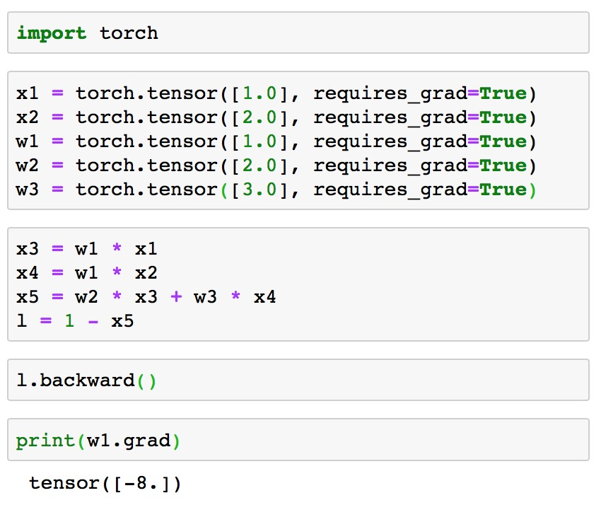

## PyTorch autograd

Thank goodness for automatic differentiation. If you have ever written a backwards function in order to calculate the gradients in a multilayered network, you would know that it is not fun...especially getting the tensor dimensions correct. PyTorch Autograd really takes the frustration and pain away from the endless tensor reshapes, tensor transposes, and other tensor operations written just to compute the gradient. How does PyTorch do it?

Let's say that the four lines below are written in PyTorch, where $x_1$ and $x_2$ are the input Tensors, $w_1$, $w_2$, $w_3$ are weights, and $L$ represents the loss.

* $x_3 = w_1 * x_1$

* $x_4 = w_1 * x_2$

* $x_5 = w_2 * x_3 + w_3 * x_4$

* $L = 1 - x_5$

If you have used PyTorch before, you probably know that during training, we would call <code>backward()</code> on the $L$ in order to calculate the gradients of the trainable parameters (weights and biases) in respect to $L$. Then we would be able to update the parameters by taking a "step" towards the negative gradient direction. Well, have you wondered how PyTorch is able to keep track of everything? From computations to gradients? The answer is __Computation Graph__.

## Computation Graph

The graph below encodes a complete history of computation for the four lines of code above. You can see that the Tensors and the operations (functions) made between them build up an acyclic graph.

* nodes represent functions
* incoming edges represent function inputs
* outgoing edges represent function outputs

To be more specific, each node is actually a <code> grad\_fn</code> attribute of a Tensor. For example, in our example above, the <code>grad\_fn</code> attribute of Tensor $x_5$ is __addition__. This means that Tensor $x_5$ is created through the addition operator. You can see that all the orange nodes in the example computation graph is indicated by a <code>grad\_fn</code> operator. All the grey nodes do not have an operator because they are Tensors defined by the user, so <code>grad\_fn</code> of those Tensors is set to <code>None</code>.

### PyTorch is Dynamic!

Computation graph is created on the fly. This means that as operations are performed on the input tensors that has autograd turned on, <code>requires_grad = True </code> , new nodes are added to the graph incrementally. Below demonstrates the step by step creation of the computation graph.

## Backwards Propagation

Calling <code>backward()</code> and calculating the gradients destroys the computation graph! (By default). Make sure to use <code> retain_variables = True</code> if you want to do the backward on some part of the graph twice.

* Each edge is the gradient from one node to another
* Calling the <code>backward()</code> function on one Tensor triggers the <code>backward()</code> function in every Tensor that came before

## Gradients

Now that we have our computation graph with the edges representing the local gradients, we can finally see how to find let's say $\frac{\partial L}{\partial w_1}$. Finding the derivative is super easy with this gradient graph because it is simply a path finding problem. To solve for $\frac{\partial L}{\partial w_1}$, we find the path between node $L$ and node $w_1$, and we multiply the edges along the path to compute the derivative. If there are multiple paths, we would add the products from each path.

$\frac{\partial L}{\partial w_1} = \frac{\partial L}{\partial x_5} * \frac{\partial x_5}{\partial w_2x_3} * \frac{\partial w_2x_3}{\partial x_3} * \frac{\partial x_3}{\partial w_1} + \frac{\partial L}{\partial x_5} * \frac{\partial x_5}{\partial w_3x_4} * \frac{\partial w_3x_4}{\partial x_4} * \frac{\partial x_4}{\partial w_1}$

$\frac{\partial L}{\partial w_1} = -1 * 1 * w_2 * x_1 + -1 * 1 * w_3 * x_2$

$\frac{\partial L}{\partial w_1} = -w_2 x_1 -w_3x_2$

### Double Check

Let's define the inputs and the weights and see if we get the same results for $\frac{\partial L}{\partial w_1}$ from the compute graph verses the magic of PyTorch autograd. Let's define the user inputs below:

$x_1 = 1$, $x_2=2$, $w_1=1$, $w_2=2$, $w_3=3$

Same computation from above:

* $x_3 = w_1 * x_1$

* $x_4 = w_1 * x_2$

* $x_5 = w_2 * x_3 + w_3 * x_4$

* $L = 1 - x_5$

#### Using equation derived from compute gradient graph:

$\frac{\partial L}{\partial w_1} = -w_2 x_1 -w_3x_2$

$\frac{\partial L}{\partial w_1} = -2 * 1 - 3 * 2 = -8$

#### Using PyTorch:

Yay! They match!
