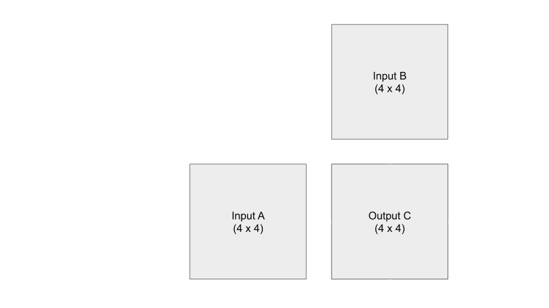

Let's talk about tiled matrix multiplication today. This is an algorithm performed on GPUs due to the parallel nature of matrix multiplication. We will especially look at a method called "tiling," which is used to reduce global memory accesses by taking advantage of the shared memory on the GPU. Tiling can be seen as a way to boost execution efficiency of the kernel. We will then examine the CUDA kernel code that do exactly what we see in the visualization, which shows what each thread within a block is doing to compute the output.

Keep in mind that this post is not meant to teach you CUDA coding, but rather it is meant to help viewers gain some visual intuition on what each thread is doing in a basic tiled matrix multiplication algorithm. I strongly believe that writing the code (launching the kernel, index calculations...) will come easily if you understand and _see_ what you are trying to code.

## Why should you care?

The efficiency of calculating matrix multiplication is the backbone of everything. Everything as in rendering graphics and machine learning. Ever heard of Tensors? Yeah...everything is matrix multiplication I swear.

## Some background

The main idea of using GPUs for computation is simple. The idea is to get more work done in less time. Imagine you have an assignment with 4 math problems to solve, each problem taking 1 hour. You can spend 4 hours and do all 4 problems by yourself. But what if you have 3 other friends with the same assignment? Then you tell your friends to each solve 1 problem and then you all will share the solutions...because sharing is caring. This means in 1 hour, your assignment would be finished.

To finish off this analogy, each one of your friends is a worker, or an unit of execution, a thread. When you have a lot of workers (threads) to manage, you might want to organize them in a way. Below is the organization of threads in CUDA terms.

* __Thread__: single unit of execution --- each thread has its own memory called _registers_
* __Block__: group of threads --- all threads in a block has access to a shared memory called _shared memory_
* __Grid__: group of blocks --- all threads in a grid has access to _global memory_ and _constant memory_

## Problem setup

Given a 4x4 input matrix A and a 4x4 input matrix B, I want to calculate a 4x4 output matrix C. Since C consists of 16 elements, where each element is computed through a dot product of a row of A and a column of B, then let's launch 16 threads, where each thread calculates 1 output element. For the sake of this example, let's say the threads is organized into a 2x2 block, and there are 4 blocks in a grid.

## Visualization

Let's see what each thread within each block is doing. From the visualization below, you can see that each thread is responsible for loading input elements into the shared memory. Remember that shared memory is _shared_ within each block. This means that each of the four threads in a block in this example can _see_ what the other three threads loaded into share A and share B. You can see that we are essentially doing mini-matrix multiplication using shared memory, storing the temporary result somewhere, and then continue summing the temporary results of the next mini-matrix multiplication. When we are finished with each individual mini-matrix multiplication, each thread would load their corresponding result to the output C element that they are mapped to. Keep in mind that we are only looking at the threads in one block, don't forget that all the other threads in the other three blocks are also doing their version of the calculations AT THE SAME TIME. Just think about it...

Let's compare global memory accesses with and without tiling. A global memory access is accessing elements of either input A or input B.

__Without tiling__: In order to calculate one output element, a thread will need to access one entire row of input A and one entire column of input B, for calculating the dot product. In our example, that is __8 accesses per thread__.

__With tiling__: Each thread ends up loading two elements from input A and two elements from input B, which totals up to __4 accesses per thread__.

In general, reduction in global memory accesses in tiling matrix multiplication is proportional to the dimension of the blocks used. This means that with blocks size of NxN, the potential reduction of global memory traffic would be N. So in our example, since we used 2x2 blocks, we can see that global memory accesses __with tiling__ is 1/2 of the global memory accesses __without tiling__.

## Kernel code

Many details of the coding is abstracted away with the explanation above, since I want you to build an intuitive visual understanding of what is going on. However, I will include the CUDA kernel code below if you are curious! Try and match each numbered line with the visualization!

* In the code below, the width that is in the argument is the width of the output C.
* You can see that the number "2" is used throughout the code, this is to match our simple example above, as it is the block width or tile width.
* threadIdx is specific to a block, and blockIdx is specific to a grid. Since our matrix multiplication example has a two dimensional output, then it is easiest to organize the threads in 2D. So the four threads in a block is actually indexed like thread00, thread01, thread10, thread11, where the first and second number corresponds to the row number and the column index within its block. This is also the case for how each block (block00, block01, block10, block11) is indexed in this example.
* __syncthreads() is a barrier synchronization line that says no threads can continue execution of the remaining code until all threads have reached that point in their execution. This is super important for the correctness of this algorithm.

        __global__ tile_matrix_multiply(float* A, float* B, float* C, int width)

              1.   __shared__ shareA[2][2];
              2.   __shared__ shareB[2][2];
              3.   int bx = blockIdx.x; int by = blockIdx.y;
              4.   int tx = threadIdx.x; int ty = threadIdx.y;
              5.   int row = by * 2 + ty;
              6.   int col = bx * 2 + tx;
              7.   float temp = 0;
              8.   for(int i = 0; i < width/2; ++i){

              9.       shareA[ty][tx] = A[row*width + (i*2 + tx)];
              10.      shareB[ty][tx] = B[(i*2 + ty)*width + col];
              11.      __syncthreads();

              12.     for(int k = 0; k < 2; ++k){
              13.       temp += shareA[ty][k] * shareB[k][tx];
              14.       __syncthreads();
                      }
                   }
              15.  C[row*width + col] = temp;

Please do not hesitate to comment down below if you have any questions regarding the visualization or code!
