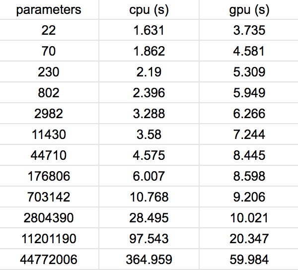
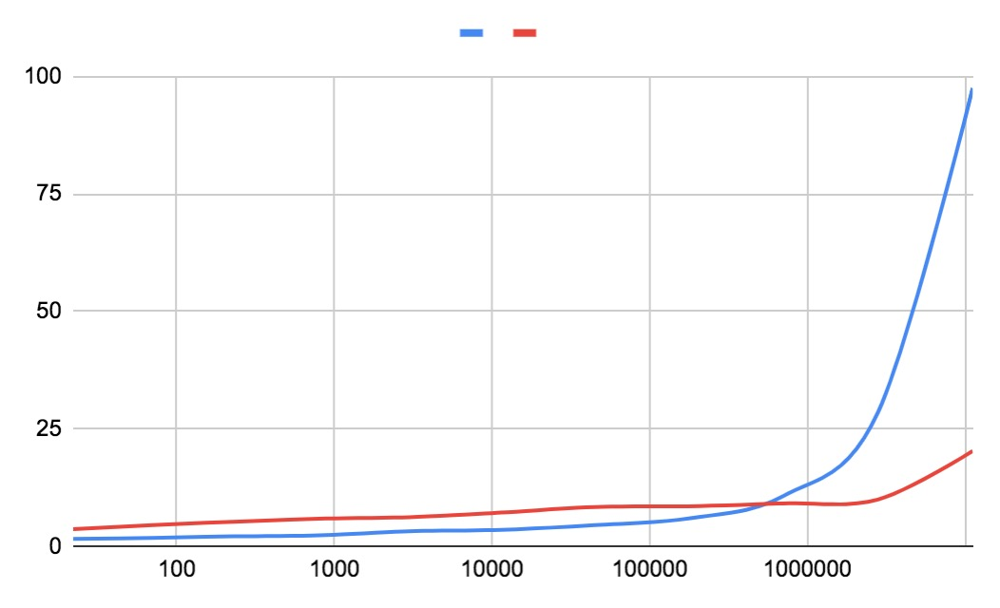

This is going to be a super chill post. While at Peet's Coffee catching up with a friend and enjoying some cafe time, I noticed that his laptop had a nvidia gpu (that green sticker ya know). So naturally, I asked wouldn't it be fun to run some deep learning training models on his laptop and see how it fares with running the same model on my laptop's cpu.

We will use PyTorch in our example below. I will walk you through the steps to:

* Generate simple training dataset
* Define deep learning model
* Setup training
* Modify code for computing on nvidia gpu

Before we start, lets make sure we have the imported libraries.

      import torch
      import math
      import time

      from torch import optim
      from torch import nn

## The Dataset

The training dataset is generated by <code>generate\_disc\_set</code> where a <code>train\_input</code> sample is a random point (x, y) between [-1, 1] and <code>train_label</code> is either 0 or 1, which indicates if a sample input is within a 0.5pi radius circle centered around the origin. 1000 samples are generated to make up the training set.

      def generate_disc_set(num_points):
          _input = torch.empty(num_points, 2).uniform_(0, 1)
          _target = _input.pow(2).sum(1).sub(1 / (2*math.pi)).sign().neg().add(1).div(2).ceil()
          return _input, _target.long()

      # Generate 1000 training samples and its labels
      train_input, train_target = generate_disc_set(1000)

      # Normalize the samples
      train_input = train_input.sub_(train_input.mean()).div_(train_input.std())

## The model

I used a simple linear model with Relu activations for this task. I tested the runtime with increasing number of hidden layers, with doubling the number of neurons in each new layer than the previous. So the number of parameters for each model increased exponentially. I simply used <code>nn.sequential</code> to generate the models with varying layers ranging from 2 to 12 layers. Below is an example of an eight layer model.

      def create_model():
          return nn.Sequential(
              nn.Linear(2, 4),
              nn.ReLU(),
              nn.Linear(4, 8),
              nn.ReLU(),
              nn.Linear(8, 16),
              nn.ReLU(),
              nn.Linear(16, 32),
              nn.ReLU(),
              nn.Linear(32, 64),
              nn.ReLU(),
              nn.Linear(64, 128),
              nn.ReLU(),
              nn.Linear(128, 256),
              nn.ReLU(),
              nn.Linear(256, 2)
          )

      model = create_model()

## Training

Below is the training code for training without using the gpu. We simply define the loss criterion, an optimizer, and mini batch size. With a learning rate of 0.01, the varying models reach training errors of 0% within 100 epochs, but of course, accuracy is not the main focus of this post.

      criterion = nn.CrossEntropyLoss()
      optimizer = optim.SGD(model.parameters(), lr=0.1)
      mini_batch_size = 100

      start_time = time.time()
      for k in range(100):

          acc_loss = 0
          nb_train_errors = 0

          for n in range(0, train_input.size(0), mini_batch_size):
              output = model(train_input.narrow(0, n, mini_batch_size))  
              pred = torch.argmax(output, dim=1)
              labels = train_target.narrow(0, n, mini_batch_size)
              nb_train_errors += torch.sum(pred != labels)
              loss = criterion(output, labels)
              acc_loss = acc_loss + loss
              loss.backward()

              # Update parameters         
              optimizer.step()
              optimizer.zero_grad()

          print('Epoch {:2d}: Train Loss {:6.2f}, Train Error: {:5.02f}%'
                .format(k,
                        acc_loss,
                        (100 * nb_train_errors) / train_input.size(0)))

      time_elasped = time.time() - start_time

## Modifying code for gpu

Since I already have the training code in PyTorch that runs on my laptop, my friend will need to run the same training code, but just make sure that the gpu is used for computation. This is easily done when using PyTorch and Nvidia gpu.

* check if the gpu is available with <code>torch.cuda.is\_available()</code>
* get the gpu name just to make sure with <code>torch.cuda.get\_device\_name(0)</code>
* port model and train dataset tensors to gpu before train loop with <code>.cuda()</code>

In the end, only 3 lines of code needed to change:

      model = create_model().cuda()
      train_input = train_input.cuda()
      train_target = train_target.cuda()

## The result

Below is a table of the raw values. Where each column from left to right represent the number of total parameters, the training time cpu  (blue line), and the training time on gpu (red line). The total time is calculated as the run time of 100 epochs. This data is graphed below where the horizontal axis is on a log scale for better visual.

As you can see, the gpu starts to beat the cpu after 700,000 parameters are used in the model. This many parameters corresponds to 10 layers in our example. This result makes sense, since the deeper the model, the more the parameters, and with increased computation per epoch, the more it makes sense to use gpus for training. It would be fair to say that intensive deep learning training requires hardware, hardware that is good at computing matrix multiplication, as both forward and backward passes involve matrix multiplication...and that's where gpus come in. So there you go, I know this was a minimal post, but I hope you got something out of it!
